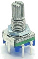
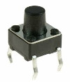

# EncoderButton

> **The new version of EncoderButton can now be found in the [InputEvents library](https://github.com/Stutchbury/InputEvents).**


A comprehensive Rotary Encoder & Button library that makes working with rotary encoders (with or without a button) and individual buttons very efficient. 

* Read the position & encoder increment for pressed and non-pressed actions. 
* Rate limit the encoder events without losing steps (eg for easy acceleration or to reduce events sent over Serial). 
* Multi-click events (single, double, triple - however many you want).
* Optional long press repeat.
* Many other events are fired (see below).

It is effectively an event wrapper for Paul Stoffregen's [Encoder library](https://www.pjrc.com/teensy/td_libs_Encoder.html) & Thomas Fredericks' [Bounce2 library](https://github.com/thomasfredericks/Bounce2) and inspired by Lennart Hennigs [Button2 library](https://github.com/LennartHennigs/Button2)

Huge thanks to all of the above - I am standing on the shoulders of giants.

Use any or all combinations of these:

 and/or  and/or 


## INSTALLATION & DOWNLOAD
Install via the Arduino Library Manager or download from [github](https://github.com/Stutchbury/EncoderButton).

## BASIC USAGE

### INSTANTIATE

```cpp
#include <EncoderButton.h>
EncoderButton eb1(<ENCODER_PIN1>, <ENCODER_PIN2>, <SWITCH_PIN>);

// Create one or more callback functions 
void onEb1Encoder(EncoderButton& eb) {
  Serial.print("eb1 incremented by: ");
  Serial.println(eb.increment());
  Serial.print("eb1 position is: ");
  Serial.println(eb.position());
}
```

### SETUP

```cpp
// Link event to function defined above
eb1.setEncoderHandler(onEb1Encoder);
```
### LOOP

```cpp
// Call 'update' for every EncoderButton
eb1.update();
```

## Constructors

Construct a rotary encoder with a button
```cpp
EncoderButton(byte encoderPin1, byte encoderPin2, byte switchPin);
```
Construct a rotary encoder without a button
```cpp
EncoderButton(byte encoderPin1, byte encoderPin2);
```
Construct a button only
```cpp
EncoderButton(byte switchPin);
```

## Loop method

There is only one method to be called from loop but it must be called for each defined ```EncoderButton```.  

**```void update()```** reads the position of the encoder and updates the state of the button. This will fire the appropriate handlers.

## Setup methods

Normally called from within ```setup()``` but can be updated at runtime.

### Setting button callback handlers

Each of these methods (optionally) sets the function to be called on the event being fired. 

They all take a single argument of your function name (except ```setLongPressHandler``` which takes and optional ```bool``` to repeatedly fire or not).

For an ESP8288/32 or Teensy you can also pass a class method - see ```ClassMethodLambdaCallback.ino``` in the examples.

**```setChangedHandler```** fires when button state changes:  
Rarely used - try 'pressed', 'released' or 'clicked' first.

**```setPressedHandler```** fires after button is pressed down:

**```setReleasedHandler```** fires after button is released:  
Note: if the encoder is turned while pressed, then 
the 'encoder released' callback is fired instead.

**```setClickHandler```** fires after button is clicked (when pressed duration is less than setLongClickDuration() (default 750ms)   
Note: the number of multi clicks can be read from EncoderButton.clickCount() in the callback so you are not limited to double or triple clicks - any number can be actioned.   
If double or triple click callbacks are set, this will not be fired for those events.

**```setDoubleClickHandler```** fires after button is double clicked  
Determined by ```setMultiClickInterval()``` (default 250ms)   
Syntactic sugar for click handler + clickCount == 2
    
**```setTripleClickHandler```** fires when button is triple clicked  
Syntactic sugar for click handler + clickCount == 3

**```setLongClickHandler```** fires *after* button is long clicked (ie when pressed duration is greater than ```setLongClickDuration(ms)``` (default 750ms)   
See also long press handler

**```setLongPressHandler```** fired *while* button is long pressed.   
By default, this fires once but can fire every ```setLongClickDuration()``` by passing 'true' as a second argument to ```setLongPressHandler()``` or by setting ```setLongPressRepeat()``` to true.   
Use ```longPressCount()``` in callback to read the number of times fired.


### Setting encoder callback handlers

As per buttons, each of these methods (optionally) sets the function to be called on the event being fired. They all take a single argument of your function name.

**```setEncoderHandler```** fires when the encoder is turned. By default is fired once per 'click' but can fire full quadrature encoding if ```useQuadPrecision()``` is set to 'true'

**```setEncoderPressedHandler```** fires when the encoder is turned while pressed.

**```setEncoderReleasedHandler```** fires after encoder is released *and turned* (if not turned the button 'released' handler is fired).

    
**```setIdleHandler```** fires after the encoder or button has been idle for ```setIdleTimeout(ms)``` (default 10 seconds).

### Button settings    

**```setDebounceInterval(unsigned int intervalMs)```** - default is set in the Bounce2 library (currently 10ms)

**```setMultiClickInterval(unsigned int intervalMs)```** - set the interval (in ms) between double, triple or multi clicks.

**```setLongClickDuration(unsigned int longDurationMs)```**  - set the ms that defines a long click.   
Long pressed callback will be fired at this interval if repeat is set to true via the ```setLongPressHandler()``` second argument or ```setLongPressRepeat()```.

**```setLongPressRepeat(bool repeat=false)```** - choose whether to repeat the long press callback (default is 'false').

### Encoder settings

**```setRateLimit(long ms)```** Encoder callbacks are normally fired on every loop() but for MPG style encoders this can fire a huge number of events (that may for example, swamp a serial connection).    
The encoder interupts will still be called but this setting will limit the call back firing to every set ms - read the ```EncoderButton.increment()``` for lossless counting of encoder.   
This is also how you can easily implement acceleration - simply set an appropriate rate limit and then multiply ```increment() * increment()``` in your callback function. 
Set to zero (default) for no rate limit.

**```useQuadPrecision(bool prec)```** Quadrature encoders have four states for each 'click' of the rotary switch. By default we only fire once per click.   
Set this to 'true' if you want four events per click.   
Affects both pressed+turning and no-pressed-turning.

**```resetPosition(long pos = 0)```**  Reset the counted position of the encoder. 
    
**```resetPressedPosition(long pos = 0)```** Reset the counted pressed position of the encoder. 

### Setting idle timeout 

**```setIdleTimeout(unsigned int timeoutMs)```** Set the idle timeout in ms (default 10000)

### Setting id or user state 

**```setUserId(unsigned int identifier)```** Set a user defined value to identify this button. Does not have to be unique (defaults to 0). Useful when multiple buttons call the same handler.

**```setUserState(unsigned int state)```** Set a user defined state for this button. Eg enum for ON, OFF, INACTIVE etc. Not used by the library.

### Read button state

From within your callback function.

**```buttonState()```** Directly get the current button state from Bounce2.

**```unsigned long currentDuration()```** Directly get the duration of the button current state from Bounce2.

**```unsigned long previousDuration()```** Directly get the duration of the button previous state from Bounce2.

**```unsigned char clickCount()```** The number of multi-clicks that have been fired in the clicked event.
    
**```uint8_t longPressCount()```** The number of times the long press handler has  been fired in the button pressed event

### Read encoder state    

From within your callback function

**```int16_t increment()```** Returns a positive (CW) or negative (CCW) integer. Is normally 1 or -1 but if your loop() has lots of processing, your Arduino is slow or you ```setRateLimit()``` this will return the actual number of increments made by the encoder since the last encoder handler event.

**```long position()```** The current position of the encoder. Can be reset by ```resetPosition()```.

**```long pressedPosition()```** The current position of the encoder when pressed. Can be reset by ```resetPressedPosition()```.

### Timeout
**```unsigned long msSinceLastEvent()```** Returns the number of ms since any event was fired for this encoder/button.

### Getting user id or user state 

**```unsigned int userId()```** Return the user defined value that identifies this button. May not be unique.

**```unsigned int userState()```** Returns the user defined state for this button.

### Enabling/disabling the EncoderButton

**```void enable(bool=true)```** Disabling the EncoderButton will prevent all events firing and also stop incrementing the encoder position. Pass ```true``` to enable (default) or ```false``` to disable.

**```bool enabled()```** Returns ```true``` if enabled or ```false``` if disabled.